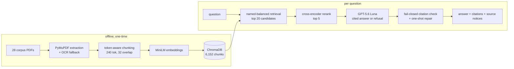

# regrag-sa-finance

A retrieval-augmented question-answering system for South African banking and consumer-credit
regulation: Prudential Authority directives, the Banks Act and its regulations, the National
Credit Act and its regulations, FSCA conduct standards, and IFRS 9. It answers only from a fixed,
version-pinned corpus with page citations, or refuses, so a compliance analyst checking a rule can
trust that every sentence traces back to a document it actually retrieved.

## Demo


The GIF above is the real pipeline answering locally. There's no hosted live model, because the
free hosting tier this project runs on can't serve one. See "Run it" below to run it yourself.
What is hosted is a static explorer of every question in the sealed test run, with the answer the
pipeline actually served, the passages it cited, any source notices, and both judges' labels:
[huggingface.co/spaces/Aakashanil67/regrag](https://huggingface.co/spaces/Aakashanil67/regrag).

## Example

Question: "Which seven categories are the operational resilience principles organised under?"

```
The principles are organised under governance, operational risk management, business continuity
planning and testing, mapping of interconnections and interdependencies of critical operations,
third-party dependency management, incident management, and resilient information and
communication technology (ICT), including cyber security. [sarb_d10_2021_operational_resilience, p.2]
```

That citation carries a source notice the pipeline attaches automatically: the cited directive
(D10/2021) is treated as superseded by a later instrument, per SARB Circular C1/2026. The answer
is correct as a reading of the source text; the notice is what tells the analyst not to rely on
that source as current law without checking further.

## Results

Sealed test set, 60 questions (48 answerable, 12 unanswerable), run once against the frozen
pipeline:

| metric | closed-book GPT-5.6 Luna | v1.1 pipeline (baseline) | v1.2 pipeline (final) |
|---|---|---|---|
| Answerable questions answered | 42/48 | 37/48 | 37/48 |
| Judged correct — Qwen 2.5 7B | 23/48 | 28/48 | 26/48 |
| Judged correct — Llama 3.1 8B | 31/48 | 32/48 | 31/48 |
| Unanswerable questions refused | 0/12 | 11/12 | 11/12 |
| Unverified citations shown | 0/0 | 0/167 | 0/82 |

On the test-split retrieval benchmark, with reranking, all-evidence-documents-in-top-k reached
32/48 for dense search, 33/48 for BM25 and 36/48 for hybrid: hybrid scores higher here than the
dense retrieval the pipeline ships, a reversal of the dev-set result that picked dense in the
first place, and it stays unshipped because the selection rule was fixed before this run. No
human has checked these 60 answers yet. The review
was deferred, so the numbers above rest on two 7-8B local judges only, and
`reports/review_packet_v1.2.md` is sitting ready for whoever does that check. On the 34-item dev
set where a kappa was computed, the two judges agreed on 59-68% of graded items (kappa 0.32 on the
RAG run, 0.51 closed-book), a real but middling agreement between two weak graders, not a ground
truth. At n=60, the Wilson interval on "answered" is 63%-87%, wide enough that 37/48 and 42/48
aren't confidently different from each other. The whole evaluation, dev sweeps and sealed test
runs together, cost $0.25 in GPT-5.6 Luna calls.

## How it works



`api/main.py` is a FastAPI service in front of this pipeline; `app/chat.py` is the Streamlit chat
UI, talking to the API over HTTP instead of importing the RAG code directly.

## Design decisions

**The v1.1 embedder was silently truncating most of what it stored, and counting tokens on the
wrong tokenizer is what hid it.** v1.1 cut chunks at 800 tokens by a generic tokenizer, but the
MiniLM embedder only reads 256 wordpieces, so 614 of 795 chunks lost roughly three-quarters of
their text before it ever reached the model. Chunking against the embedder's own wordpiece count
(240 tokens, 32 overlap) fixed it: nothing is truncated at 6,152 chunks, and it's the single
biggest reason the fixed pipeline retrieves more evidence documents than the old one.

**BM25 and hybrid retrieval, measured, not assumed, better.** Both were built and benchmarked
against dense semantic search on the dev set, and neither won: hybrid's all-documents-hit rate on wordpiece topped out at 26/34 against
dense's 28/34, so dense stayed; the selection rule picks on measured task outcome, not on trying
the newer technique. A negative result, but a measured one, not a guess.

**Fail-closed citations, checked structurally, with one repair attempt.** Every citation is checked against
the exact (document, page) pairs the model was actually shown,
and a bad one fails the response closed rather than reaching the user. The model gets one
attempt to repair a malformed citation line before that happens. On the sealed test run, 1 repair
was attempted and 82 of 82 served citations verified.

**Every eval question is grounded in quoted evidence.** Answerable or not, each one is written
against a specific quoted passage the author
checked existed in the corpus before writing the reference answer, instead of being invented and
hoped answerable. The sealed 60-question test set was frozen and run exactly once against
the pipeline described above; nothing was re-run to improve the number.

**Exact cosine search, not ChromaDB's approximate HNSW index.** Chroma's HNSW graph rebuilds by re-inserting every embedding on each fresh
process with a thread-pool insertion order that isn't fixed, so identical queries against an
identical on-disk index returned different top-k results across separate launches. At this
corpus's scale, exact search costs low milliseconds and buys a sealed run-once protocol
reproducibility that an approximate index can't guarantee.

## What doesn't work yet

- The 60-answer sealed run hasn't been reviewed by a person. Only Qwen 2.5 7B and Llama 3.1 8B
  graded it, and their dev-set kappa (0.32-0.51) says they're a cheap second opinion, not ground
  truth. `reports/review_packet_v1.2.md` has every item ready for that review.
- Retrieval is the main limiter on the answer rate: 8 of 48 answerable test questions retrieved no
  evidence page at all. Three of the eleven refusals were multi-part questions where only one of
  two named sources came back.
- Two items went the other way: the model answered a buy-now-pay-later question from adjacent,
  not on-point, text (t50), and went along with a false premise about debt-counsellor conduct
  because the relevant page wasn't retrieved (t57).
- The final FMA Conduct Standard 2 of 2018 isn't in the corpus: its current URL on the FSCA's
  JS-rendered site couldn't be resolved for this release, and Conduct Standard 3 of 2020 (Banks)
  is a scanned image PDF read only through OCR.
- The sealed set is 60 items. The Wilson interval at that size is wide enough (63%-87% on
  "answered") that small differences between pipeline versions aren't confidently distinguishable.
- There's no authentication on the API; it's a research/demo tool, not a multi-tenant service.

## Run it

Requires Python 3.12.

```bash
python -m venv .venv
.venv\Scripts\activate  # or `source .venv/bin/activate` on Linux/macOS
pip install -r requirements.txt
```

Copy `.env.example` to `.env` and set `OPENAI_API_KEY` (default provider, GPT-5.6 Luna) or switch
`LLM_PROVIDER` to `anthropic` or `ollama`.

```bash
python -m scripts.fetch_corpus       # downloads the 28 corpus PDFs, verifies pinned SHA-256
python -m scripts.validate_manifest  # enforces the authority/stage/status schema contract
python -m src.chunking               # chunks the corpus
python -m src.store --rebuild        # embeds and builds the ChromaDB collection

uvicorn api.main:app --reload
streamlit run app/chat.py
```

Evals:

```bash
python -m evals.run_eval --split dev --config wordpiece --label wordpiece --max-usd 0.1
python -m evals.retrieval_bench --split dev --configs baseline,wordpiece,bge
```

`ruff check .`, `ruff format --check .` and `pytest -q` should all pass clean.

### Docker

```bash
docker compose up --build
```

Brings up the API on `127.0.0.1:8000` and the chat UI on `127.0.0.1:8501`, loopback-only by
default.

## More detail

[`DECISIONS.md`](DECISIONS.md), [`reports/failure_analysis.md`](reports/failure_analysis.md),
[`reports/runs/test-final.md`](reports/runs/test-final.md),
[`reports/judge_agreement.md`](reports/judge_agreement.md), [`corpus/README.md`](corpus/README.md),
[`reports/security_notes.md`](reports/security_notes.md).
