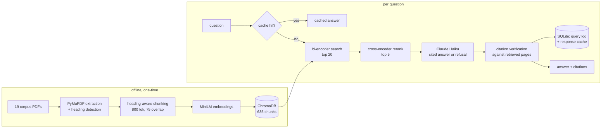

# regrag-sa-finance

A retrieval-augmented assistant that answers questions about South African financial regulation
(SARB prudential directives, the National Credit Act, FSCA conduct standards, IFRS 9) from a
fixed local corpus of 19 primary-source PDFs. Every factual claim in an answer carries an inline
`[doc_id, p.X]` citation checked against the pages the system actually retrieved, and the system
refuses rather than answers when the retrieved context can't support a response. The eval harness
is the point of the project, not a checkbox after the fact: chunking and retrieval decisions were
made by sweeping alternatives against a retrieval benchmark and a RAGAS-judged golden set, and the
numbers below are what that sweep produced, not what was assumed going in.

## Eval results

Reranked retrieval (`chunk_size=800`, cross-encoder rerank on) against the un-reranked, smaller-chunk
baseline it replaced, both measured on the same 20-question retrieval benchmark:

| | chunk size | rerank | hit-rate@5 | MRR |
|---|---|---|---|---|
| before | 500 | off | 85% | 0.654 |
| **after** | **800** | **on** | **95%** | **0.808** |

RAGAS scores on the golden set's 45 answerable items (`claude-haiku-4-5` as both generator and
judge), same before/after split:

| | n scored | faithfulness | answer relevancy | context precision | context recall |
|---|---|---|---|---|---|
| before | 34 | 0.791 | 0.851 | 0.673 | 0.912 |
| **after** | **39** | **0.829** | 0.811 | **0.790** | **0.968** |

Context precision moved the most, which fits: cutting retrieval noise is what reranking is for.
Answer relevancy dipped slightly; that number is reported as measured, not smoothed over. Full
sweep (300/500/800 tokens × rerank on/off) in
[`reports/improvement_log.md`](reports/improvement_log.md); the RAGAS run in
[`reports/eval_summary.md`](reports/eval_summary.md); the ten worst-scoring golden items
individually diagnosed in [`reports/failure_analysis.md`](reports/failure_analysis.md), where three
turned out to be RAGAS judge artifacts rather than real defects, confirmed by dumping the retrieved
chunk text against the model's quoted claims.

A response cache (exact-match on normalised question text, so a rephrased question is still a
live call) cuts median latency from 4489ms / $0.00365 per query to 1ms / $0, measured in
[`reports/perf.md`](reports/perf.md).

## Architecture



`api/main.py` (FastAPI: `/ask`, `/health`, `/stats`, rate-limited) sits in front of this pipeline;
`app/chat.py` and `app/ops.py` are the Streamlit chat UI and observability dashboard, each a
separate deployable process talking to the API over HTTP, not importing the RAG code directly.

## Run locally

Requires Python 3.12.

```bash
python -m venv .venv
.venv\Scripts\activate  # or `source .venv/bin/activate` on Linux/macOS
pip install -r requirements.txt
```

`chroma-hnswlib` compiles a C extension on install. On Windows this needs the Microsoft C++ Build
Tools (Visual Studio Installer, "Desktop development with C++" workload); Linux/macOS wheels are
usually prebuilt.

Copy `.env.example` to `.env`. Three provider options, picked by `LLM_PROVIDER`:

- `anthropic` (default): set `ANTHROPIC_API_KEY`. This is what generated every number above.
- `openai`: set `OPENAI_API_KEY`. Not benchmarked here; the eval harness assumes Claude as judge.
- `ollama`: no key, fully local, needs `ollama pull llama3.1:8b` and the daemon running. Quality
  will differ from the benchmarked config; useful for running the pipeline with zero API cost.

```bash
python -m scripts.fetch_corpus       # downloads the 19 PDFs, verifies against pinned SHA-256
python -m src.chunking               # chunks, embeds into a fresh reports/chunk_quality.md
python -m src.store --rebuild        # builds the ChromaDB collection
python -m evals.retrieval_bench      # reports/retrieval_bench.md
python -m evals.run_ragas            # reports/eval_summary.md + reports/eval_history.csv

uvicorn api.main:app --reload
streamlit run app/chat.py
streamlit run app/ops.py
```

`ruff check .`, `ruff format --check .`, and `pytest -q` (67 tests, all against mocked LLM calls,
no API key needed) should all pass clean.

### Docker

```bash
docker compose up --build
```

Brings up the API (`:8000`), chat UI (`:8501`), and ops dashboard (`:8502`) as three containers.
The compose file bind-mounts the repo over each image's `/app`, so `corpus/`, `chroma/`, and the
sqlite log/cache (all gitignored, built locally by the commands above) are visible to the
containers without being baked into the image.

## What isn't built

The API and both Streamlit apps run locally and in Docker; there's no hosted URL. Render or
Streamlit Cloud deployment was scoped out of this project on purpose, not forgotten.

Two multi-document comparison questions in the golden set still fail. A query like "what body do
directive X and directive Y both cite" embeds as one vector, and the document with fewer chunks
loses to whichever document's vocabulary the embedding happens to resemble more. `src/agent.py`
adds a bounded retrieve-decide-requery loop to fix exactly this, and on the ten multi-doc golden
items it was tested against, it fixed zero of the two target cases while tripling cost and adding
real latency (see [`reports/agent_eval.md`](reports/agent_eval.md)). A same-question re-run
afterward flipped one target case from refusal to a correct answer with identical code, which
points at run-to-run LLM non-determinism rather than a fixable bug — the full result is in the
"Agent extension" section of [`DECISIONS.md`](DECISIONS.md). Query decomposition, a separate
retrieval call per named document, looks like the more promising fix and isn't built.

The API has no authentication, and its rate limiting is per-process and in-memory, so a
distributed client or a shared NAT defeats it easily. Neither gap is silently assumed away — both
are written up in [`reports/security_notes.md`](reports/security_notes.md).

## Limitations

The corpus is 19 documents fetched and checksummed on 2026-08-24; it doesn't update itself, so a
question about a regulation issued after that date gets a correct refusal, not an error. Every
RAGAS score reported here comes from Claude-haiku-4-5 judging Claude-haiku-4-5's own output, a
same-family judge bias that [`reports/failure_analysis.md`](reports/failure_analysis.md) confronts
directly: three of the ten worst-scoring golden items were judge artifacts, not real defects,
confirmed by hand rather than assumed. This tool answers what a document says; it does not give
legal advice, and the system prompt says so on every response.

## Further reading

[`DECISIONS.md`](DECISIONS.md) is a running log of what actually happened while building this —
real bugs, the numbers that didn't move the way I expected, dependency conflicts and how they were
actually resolved — kept as it was written rather than cleaned up into a tidy retrospective.
