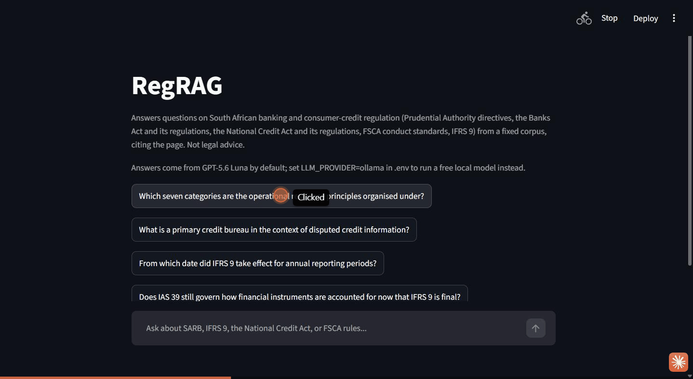
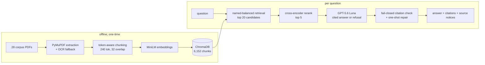

# regrag-sa-finance

Ask a question about South African banking or consumer-credit regulation and get an answer that
cites the page it came from, or a refusal when the documents don't cover it. The corpus is fixed
and version-pinned: 28 documents, among them Prudential Authority directives, the Banks Act and its
regulations, the National Credit Act and its regulations, FSCA conduct standards and IFRS 9. I
built it for the check a compliance analyst makes before relying on a rule.

## Demo



The GIF is the app running on my laptop. There is no hosted version, because free hosting can't
run the model and the index together; [Run it](#run-it) covers running it yourself.

What is online is a static explorer of the sealed test run: all 60 questions, the answer the
pipeline served, the passages it cited, its source notices and both judges' labels. It lives at
[huggingface.co/spaces/Aakashanil67/regrag](https://huggingface.co/spaces/Aakashanil67/regrag).

## Example

Question: "Which seven categories are the operational resilience principles organised under?"

```
The principles are organised under governance, operational risk management, business continuity
planning and testing, mapping of interconnections and interdependencies of critical operations,
third-party dependency management, incident management, and resilient information and
communication technology (ICT), including cyber security. [sarb_d10_2021_operational_resilience, p.2]
```

The pipeline attached a notice to this answer: Directive D10/2021 is treated as superseded, per
SARB Circular C1/2026. The answer reads the directive correctly. The notice tells the analyst that
the directive itself is no longer the current rule.

## Results

The sealed test set has 60 questions, 48 answerable from the corpus and 12 not. It was written
before any tuning and run once, after the pipeline was frozen. Closed-book means the same model
with no retrieval.

| | Closed-book GPT-5.6 Luna | v1.1 pipeline | v1.2 pipeline |
|---|---|---|---|
| Answerable questions answered | 42/48 | 37/48 | 37/48 |
| Judged correct by Qwen 2.5 7B | 23/48 | 28/48 | 26/48 |
| Judged correct by Llama 3.1 8B | 31/48 | 32/48 | 31/48 |
| Unanswerable questions refused | 0/12 | 11/12 | 11/12 |
| Unverified citations shown | n/a | 0 of 167 | 0 of 82 |

v1.2 is not more accurate than v1.1. The retrieval changes described below altered which chunks
come back, but correctness moved by one or two answers either way. At this size that is noise: the
95% Wilson interval on 37 of 48 answered runs from 63% to 87%.

What retrieval does buy is refusal. Given 12 questions the documents can't answer, Luna on its own
answered all 12. The pipeline refused 11, and every citation it showed pointed at a page it had
actually retrieved.

These answers have not yet been checked by a person. The correctness rows come from two local
models of 7 to 8 billion parameters. On the dev set they agreed on 59% of the RAG answers both
graded (kappa 0.32) and 68% of the closed-book ones (kappa 0.51), so I read them as a rough second
opinion. The packet for a human review is ready in
[`reports/review_packet_v1.2.md`](reports/review_packet_v1.2.md).

On retrieval alone, with reranking, the shipped search found every evidence document for 32 of the
48 answerable test questions. BM25 found 33 and hybrid search 36. Hybrid had lost on the dev set,
so it wasn't selected, and I left that choice alone after seeing the test numbers.

Everything above, including dev runs and smoke tests, cost $0.25 in GPT-5.6 Luna calls. Grading ran
locally.

## How it works



A FastAPI service (`api/main.py`) wraps the pipeline. The Streamlit chat app (`app/chat.py`) calls
that API over HTTP.

## Design decisions

### Chunks sized to what the embedder reads

v1.1 cut chunks at 800 tokens using a general-purpose tokenizer, but the MiniLM embedder reads only
the first 256 wordpieces of its input. 614 of the 795 v1.1 chunks were longer than that, and the
rest of their text was never embedded. Chunks are now sized with the embedder's own tokenizer (240
wordpieces, 32 overlap), which gives 6,152 chunks with none truncated. On the dev set this raised
correct outcomes (answered when answerable, refused when not) from 36 to 38 of 40. On the sealed
test it made no difference to accuracy.

### Exact search over ChromaDB's HNSW index

ChromaDB rebuilds its approximate HNSW index each time a process starts, and the insertion order
isn't fixed. The same query against the same stored data could return a different top 5 from one
launch to the next. At 6,152 chunks, exact cosine search in numpy is cheap and always returns the
same result, which a test set that runs once depends on. A regression test starts two separate
interpreters and checks they agree.

### BM25 and hybrid search, tested and not adopted

Regulatory questions often name an instrument number that dense embeddings blur, so I built BM25
and a reciprocal-rank-fusion hybrid. On the dev set neither beat dense search. Hybrid found every
evidence document for 26 of 34 questions against 28 for dense, and answered 30 against 32 end to
end. The sealed test later favoured hybrid, 36 against 32 of 48. Both results are reported; the
selection made before the test stands.

### Citations that fail closed

Every citation is checked against the document pages the model was shown. If any line of an answer
lacks a valid citation, the whole answer becomes a refusal. An answer whose only fault is the
citation format gets one retry, which happened once on the sealed test. This check proves that a
citation points at a retrieved page. Whether the page supports the sentence is for the judges and
the pending human review.

### Questions tied to quoted evidence

Each answerable question carries a quote copied from its source page, and a script rejects any
question whose quote isn't on that page. The unanswerable questions cover topics inside South
African financial regulation that the corpus doesn't hold. The test set was sealed with a SHA-256
hash before any tuning.

## What doesn't work yet

- No person has reviewed the sealed answers. Until someone does, the correctness figures rest on
  two small local judges that only partly agree.
- Retrieval limits the answer rate. 8 of the 48 answerable test questions retrieved no evidence
  page, and in 3 of the 11 refusals one of two needed sources was missing.
- Two answers went wrong in ways the citation check can't catch. t50 answered a buy-now-pay-later
  question from nearby National Credit Act text, and t57 accepted a false premise about debt
  counsellors because the page that contradicts it wasn't retrieved.
- The corpus has gaps. FMA Conduct Standard 2 of 2018 is missing because I couldn't find a working
  official link, and Conduct Standard 3 of 2020 (Banks) exists only as a scan, so it is read through
  OCR ([`reports/ocr_check.md`](reports/ocr_check.md)).
- The API has no authentication. It is meant to run on your own machine.

## Run it

Requires Python 3.12.

```bash
python -m venv .venv
.venv\Scripts\activate  # or `source .venv/bin/activate` on Linux/macOS
pip install -r requirements.txt
```

Copy `.env.example` to `.env` and set `OPENAI_API_KEY`; GPT-5.6 Luna is the default. Setting
`LLM_PROVIDER` to `anthropic` or `ollama` also works, and `ollama` runs a free local model.

```bash
python -m scripts.fetch_corpus       # downloads the 28 corpus PDFs, verifies pinned SHA-256
python -m scripts.validate_manifest  # enforces the authority/stage/status schema contract
python -m src.chunking               # chunks the corpus
python -m src.store --rebuild        # embeds and builds the ChromaDB collection

uvicorn api.main:app --reload
streamlit run app/chat.py
```

Evaluation:

```bash
python -m evals.run_eval --split dev --config wordpiece --label wordpiece --max-usd 0.1
python -m evals.retrieval_bench --split dev --configs baseline,wordpiece,bge
```

`ruff check .`, `ruff format --check .` and `pytest -q` should all pass.

With Docker, `docker compose up --build` starts the API on `127.0.0.1:8000` and the chat app on
`127.0.0.1:8501`, reachable only from your own machine.

## More detail

- [`DECISIONS.md`](DECISIONS.md): why the code looks the way it does, including what didn't work.
- [`reports/failure_analysis.md`](reports/failure_analysis.md): every refused or wrong answer from
  the sealed run.
- [`reports/runs/test-final.md`](reports/runs/test-final.md): full metrics for the sealed run.
- [`reports/judge_agreement.md`](reports/judge_agreement.md): where the two judges agree and
  disagree.
- [`corpus/README.md`](corpus/README.md): each document, its source and its current status.
- [`reports/security_notes.md`](reports/security_notes.md): privacy defaults and what the API does
  not protect against.
