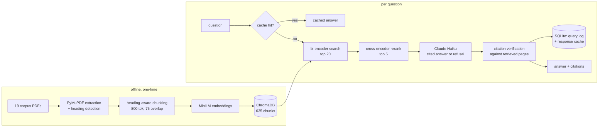

# regrag-sa-finance

A retrieval-augmented assistant that answers questions about South African financial regulation
(SARB prudential directives, the National Credit Act, FSCA conduct standards, IFRS 9) from a
fixed local corpus of 19 PDFs. Every factual claim in an answer carries an inline
`[doc_id, p.X]` citation checked against the pages the system actually retrieved, and the system
refuses rather than answers when the retrieved context can't support a response. The eval harness
is the point of the project, not a checkbox after the fact: chunking and retrieval decisions were
made by sweeping alternatives against a retrieval benchmark and a RAGAS-judged golden set, and the
numbers below are what that sweep produced, not what was assumed going in.

## Eval results

The change under test is `chunk_size=800` with cross-encoder reranking, replacing 500-token chunks
with no reranking. Both configs were measured on the same 20-question retrieval benchmark and the
same golden set.

| | chunk size | rerank | hit-rate@5 | MRR |
|---|---|---|---|---|
| before | 500 | off | 85% (17/20) | 0.654 |
| **after** | **800** | **on** | **95% (19/20)** | **0.808** |

The hit-rate line is two questions on a 20-question benchmark. Wilson intervals are 64–95% and
76–99%, overlapping heavily, so I don't treat that difference as established; MRR is the
better-powered signal in the same data, because it moves on *where* the right chunk ranks rather
than only whether it cleared a cutoff.

RAGAS on the golden set's answerable items, `claude-haiku-4-5` as both generator and judge. The two
runs scored different item sets — reranking pulled six previously-refused questions into real
answers and pushed one the other way — so the raw means are not directly comparable. Both are shown
alongside the paired comparison on the 33 items common to both runs:

| metric | before (all, n=34) | after (all, n=39) | paired Δ (n=33) | improved / regressed | sign test |
|---|---|---|---|---|---|
| faithfulness | 0.791 | 0.829 | +0.023 | 9 / 9 | p = 1.00 |
| answer relevancy | 0.851 | 0.810 | −0.041 | 10 / 11 | p = 1.00 |
| context precision | 0.673 | 0.790 | **+0.109** | **14 / 5** | p = 0.06 |
| context recall | 0.912 | 0.968 | +0.030 | 1 / 0 | p = 1.00 |

**Only context precision holds up, and even that is short of conventional significance.** The
faithfulness and recall gains in the raw means are mostly composition effects: once the item set is
held fixed, faithfulness splits 9–9 across items and recall was already at 0.939 with 32 of 33
items unchanged. What reranking demonstrably bought is *coverage* — five net refusals became
answered questions, which needs no significance test because it counts behaviour changing rather
than estimating a mean — plus a precision gain that is directionally clear and mechanistically
expected, since dropping loosely-similar chunks is exactly and only what a cross-encoder does.

I kept the config on that basis. The full working is in
[`reports/paired_comparison.md`](reports/paired_comparison.md); the sweep across
300/500/800 tokens × rerank on/off is in
[`reports/improvement_log.md`](reports/improvement_log.md); the run itself in
[`reports/eval_summary.md`](reports/eval_summary.md). The ten worst-scoring golden items are
diagnosed individually in [`reports/failure_analysis.md`](reports/failure_analysis.md), where three
turned out to be RAGAS judge artifacts rather than real defects, confirmed by dumping the retrieved
chunk text against the model's quoted claims.

A response cache (exact-match on normalised question text, so a rephrased question is still a
live call) cuts median latency from 4489ms / $0.00365 per query to 1ms / $0, measured in
[`reports/perf.md`](reports/perf.md).

## Architecture



`api/main.py` (FastAPI: `/ask`, `/health`, `/stats`, rate-limited) sits in front of this pipeline;
`app/chat.py` and `app/ops.py` are the Streamlit chat UI and observability dashboard, each a
separate deployable process talking to the API over HTTP, not importing the RAG code directly.

## Run locally

Requires Python 3.12.

```bash
python -m venv .venv
.venv\Scripts\activate  # or `source .venv/bin/activate` on Linux/macOS
pip install -r requirements.txt
```

`chroma-hnswlib` compiles a C extension on install. On Windows this needs the Microsoft C++ Build
Tools (Visual Studio Installer, "Desktop development with C++" workload); Linux/macOS wheels are
usually prebuilt.

Copy `.env.example` to `.env`. Three provider options, picked by `LLM_PROVIDER`:

- `anthropic` (default): set `ANTHROPIC_API_KEY`. This is what generated every number above.
- `openai`: set `OPENAI_API_KEY`. Not benchmarked here; the eval harness assumes Claude as judge.
- `ollama`: no key, fully local, needs `ollama pull llama3.1:8b` and the daemon running. Quality
  will differ from the benchmarked config; useful for running the pipeline with zero API cost.

```bash
python -m scripts.fetch_corpus       # downloads the 19 PDFs, verifies against pinned SHA-256
python -m src.chunking               # chunks, embeds into a fresh reports/chunk_quality.md
python -m src.store --rebuild        # builds the ChromaDB collection
python -m evals.retrieval_bench      # reports/retrieval_bench.md
python -m evals.run_ragas            # reports/eval_summary.md + reports/eval_history.csv

uvicorn api.main:app --reload
streamlit run app/chat.py
streamlit run app/ops.py
```

`ruff check .`, `ruff format --check .`, and `pytest -q` (79 tests, all against mocked LLM calls,
no API key needed) should all pass clean.

### Docker

```bash
docker compose up --build
```

Brings up the API (`:8000`), chat UI (`:8501`), and ops dashboard (`:8502`) as three containers.
The compose file bind-mounts the repo over each image's `/app`, so `corpus/`, `chroma/`, and the
sqlite log/cache (all gitignored, built locally by the commands above) are visible to the
containers without being baked into the image. Both Dockerfiles install CPU-only torch ahead of
`requirements.txt` — sentence-transformers' default resolution pulls the CUDA build on Linux, which
inflated the first version of these images to 9.73GB for two MiniLM models that only ever run on
CPU here; the API image is now 3.55GB, the UI images 3.2GB each.

## What isn't built

The API and both Streamlit apps run locally and in Docker; there's no hosted URL. Render or
Streamlit Cloud deployment was scoped out of this project on purpose, not forgotten.

Two multi-document comparison questions in the golden set still fail. A query like "what body do
directive X and directive Y both cite" embeds as one vector, and the document with fewer chunks
loses to whichever document's vocabulary the embedding happens to resemble more. `src/agent.py`
adds a bounded retrieve-decide-requery loop to fix exactly this, and on the ten multi-doc golden
items it was tested against, it fixed zero of the two target cases while tripling cost and adding
real latency (see [`reports/agent_eval.md`](reports/agent_eval.md)). A same-question re-run
afterward flipped one target case from refusal to a correct answer with identical code, which
points at run-to-run LLM non-determinism rather than a fixable bug — the full result is in the
"Agent extension" section of [`DECISIONS.md`](DECISIONS.md). Query decomposition, a separate
retrieval call per named document, looks like the more promising fix and isn't built.

The API has no authentication, and its rate limiting is per-process and in-memory, so a
distributed client or a shared NAT defeats it easily. Neither gap is silently assumed away — both
are written up in [`reports/security_notes.md`](reports/security_notes.md).

## Limitations

**The golden set has not been reviewed by a human.** I drafted the 55 items and the reference
answers, and Claude both answers and judges them. That is a closed loop, and it is the weakest
foundation under every number on this page: a reference answer that is subtly wrong produces a
confidently wrong score, and nothing in the harness would catch it. The retrieval set is in better
shape — its page labels were audited against the source PDFs after the first benchmark run scored
55%, which is how eleven mislabelled `golden.jsonl` page references were found and fixed — but that
audit checked *where the answer lives*, not whether the reference answer is correct. Independent
review is the highest-value thing this project is missing.

**The corpus mixes levels of legal authority, and until recently the system treated them as equal.**
It contains primary legislation (the National Credit Act), subordinate instruments issued under it
(SARB directives under section 6(6) of the Banks Act), explicitly non-binding guidance (Guidance
Note 3/2025 under section 6(5)), and third-party commentary (PwC's IFRS 9 practical guide).
`corpus/manifest.json` recorded issuer, title, year and category for every document from the start;
none of it reached retrieval, the prompt, or the citation. Every context block now carries its
document's real type, year, issuer and title (extracted from each PDF's own cover page — the first
pass used paraphrased titles and a live test against golden item `g24` caught it, since the
paraphrase dropped the document's own reference number), and citing third-party commentary or a
superseded instrument type now attaches a fixed, code-generated disclosure — measured the same
paired way as the chunk-size change in
[`reports/paired_comparison_metadata.md`](reports/paired_comparison_metadata.md): no RAGAS metric
moves outside noise, because this is a disclosure fix, not a retrieval or generation-quality one,
and `g24` flips from refusal to a correct answer for exactly the diagnosed reason (full story in
the "Source authority and currency metadata" section of [`DECISIONS.md`](DECISIONS.md)). What this
doesn't do is rank authority — a directive isn't marked more binding than a guidance note anywhere
the code enforces it, only named as one or the other.

**Supersession is still not modelled**, beyond flagging Circulars as a document type this corpus's
newer instruments have superseded as a category. The corpus spans 2004 to 2026 and Directive
D3/2023 states in its own text that it replaces Directive 5/2017 — a specific successor claim this
system doesn't verify or surface, on purpose: this corpus doesn't contain Directive 5/2017, so
confirming or naming that relationship isn't something the retrieved text can support.

**Retrieval is measured on a small, unbalanced corpus.** 635 chunks total, of which 333 (52%) come
from the National Credit Act alone. Benchmark figures from a corpus this size and this skewed
should not be read as predicting behaviour at realistic scale.

Every RAGAS score reported here comes from Claude-haiku-4-5 judging Claude-haiku-4-5's own output,
a same-family judge bias that [`reports/failure_analysis.md`](reports/failure_analysis.md)
confronts directly: three of the ten worst-scoring golden items were judge artifacts, not real
defects, confirmed by hand rather than assumed.

This tool reports what a document says. It does not give legal advice, does not tell you whether a
document is still in force, and the system prompt says so on every response.

## Further reading

[`DECISIONS.md`](DECISIONS.md) is a running log of what actually happened while building this —
real bugs, the numbers that didn't move the way I expected, dependency conflicts and how they were
actually resolved — kept as it was written rather than cleaned up into a tidy retrospective.
