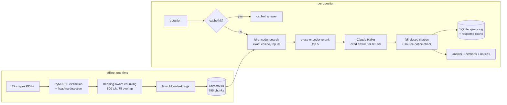

# regrag-sa-finance

A retrieval-augmented assistant that answers questions about South African financial regulation
(SARB prudential directives, the National Credit Act, FSCA conduct standards, IFRS 9) for someone
who needs a fast, citation-checked pointer into a fixed local corpus — not a substitute for reading
the source or for legal advice.

Regulatory text carries different weight depending on who issued it and whether it's still in
force: a binding SARB directive, a non-binding guidance note, and a withdrawn circular can describe
the same subject in similar language, and citing them interchangeably would misrepresent what the
law actually requires. This system tracks `authority_level`, `publication_stage` and
`current_status` per source, attaches a fixed disclosure whenever an answer cites a withdrawn
circular or third-party commentary, and refuses outright — rather than guessing — when the
retrieved context can't support an answer. A wrong refusal costs a user a follow-up question. A
wrong answer, stated as if it were current law, costs more than that.

## Sealed holdout results

30 questions, held out and cryptographically sealed (`evals/protocol.json`) before any tuning
against them, run exactly once (`python -m evals.run_release --split holdout --label v1.1.0-rc2`)
against the final, frozen pipeline:

| metric | value |
|---|---|
| Retrieval hit-rate@5 | 28/30 (93%), Wilson 95% CI 79–98% |
| Answerable answer rate | 17/24 (71%) |
| Unanswerable refusal recall | 6/6 (100%) |
| Citation-contract pass rate | 23/30 (77%) |
| Verified-citation rate | 30/30 (100%) |
| RAGAS (17 answered items) | faithfulness 0.866, answer relevancy 0.681, context precision 0.894, context recall 1.000 |

**Every citation that reached the user was verified against a page the system actually
retrieved — no fabricated reference slipped through.** That's the release gate this system exists
to hold, and the holdout confirms it holds.

**The honest limitation:** two of the six multi-document holdout questions (comparisons like
"which subject do Directive 8/2023 and Directive 8/2025 both address") failed because top-k
semantic search over the whole corpus doesn't reliably surface both named documents at once when
they're close siblings on the same subject — one crowds the other out of the top 5. That's the
majority of this holdout's answerable-rate shortfall; see `reports/failure_analysis.md` for the
full per-item breakdown, including which refusals were retrieval gaps versus the model correctly
declining to guess.

This is the second candidate. The first (`v1.1.0-rc1`) completed but diagnosing its failures found
a real citation-parsing defect, which by this project's own release rule means that holdout run was
opened and its numbers are not usable as evidence — only `rc2`'s are. Full story, including a
second defect found and fixed in retrieval itself before either run, in `reports/failure_analysis.md`
and `DECISIONS.md`.

## Run locally

Requires Python 3.12.

```bash
python -m venv .venv
.venv\Scripts\activate  # or `source .venv/bin/activate` on Linux/macOS
pip install -r requirements.txt
```

`requirements.txt` is a compatibility shim (`-r requirements-dev.txt`) for this one-environment
local setup. `requirements-api.txt` and `requirements-ui.txt` are the actual, narrower dependency
sets each Docker image installs — see the Docker section below for why the split exists.
`chroma-hnswlib` compiles a C extension on install; on Windows this needs the Microsoft C++ Build
Tools (Visual Studio Installer, "Desktop development with C++" workload). Linux and macOS wheels
are usually prebuilt.

Copy `.env.example` to `.env`. Three provider options, picked by `LLM_PROVIDER`.

- `anthropic` (default): set `ANTHROPIC_API_KEY`. This is what generated every number above.
- `openai`: set `OPENAI_API_KEY`. Not benchmarked here, since the eval harness assumes Claude as
  judge.
- `ollama`: no key, fully local, needs `ollama pull llama3.1:8b` and the daemon running. Quality
  will differ from the benchmarked configuration, but it runs the pipeline at zero API cost.

```bash
python -m scripts.fetch_corpus       # downloads the 22 corpus PDFs, verifies pinned SHA-256
python -m scripts.validate_manifest  # enforces the authority/stage/status schema contract
python -m src.chunking               # chunks the corpus, writes reports/chunk_quality.md
python -m src.store --rebuild        # embeds and builds the ChromaDB collection
python -m evals.retrieval_bench --split dev   # reports/retrieval_bench.md
python -m evals.run_release --split dev --label local-check  # reports/eval_summary.md + eval_history.csv

uvicorn api.main:app --reload
streamlit run app/chat.py
streamlit run app/ops.py
```

`ruff check .`, `ruff format --check .` and `pytest -q` should all pass clean. There are 201
tests, all run against a mocked LLM and a temporary vector store, so none of them need an API key
or the real corpus.

### Docker

```bash
docker compose up --build
```

Brings up the API on `127.0.0.1:8000`, the chat UI on `127.0.0.1:8501`, and the ops dashboard on
`127.0.0.1:8502` — loopback-only by default, not reachable from another machine without
deliberately rebinding the port mapping. The compose file bind-mounts the repo over each image's
`/app`, so `corpus/`, `chroma/`, and the SQLite log/cache files (all gitignored, built locally by
the commands above) are visible without a rebuild. `Dockerfile.api` installs CPU-only torch ahead
of `requirements-api.txt` — sentence-transformers' default resolution otherwise pulls the CUDA
build on Linux, which inflated the first version of this image to 9.73GB for two MiniLM models
that only ever run on CPU here. The API image now measures 2.73GB; the chat and ops images, which
install `requirements-ui.txt` and never import torch, ChromaDB, sentence-transformers, or the
Anthropic SDK at all, measure 803MB each.

## Architecture



`api/main.py` is a FastAPI service (`/ask`, `/health/live`, `/health/ready`, `/stats`,
`/recent-queries`, rate-limited, CORS-restricted to the chat UI's own origin) sitting in front of
this pipeline. `app/chat.py` and `app/ops.py` are the Streamlit chat UI and observability
dashboard, each a separate deployable process talking to the API over HTTP rather than importing
the RAG code directly.

## Design decisions and their trade-offs

**Chunk size 800 with cross-encoder reranking, not 500 with none.** A sweep across 300/500/800
tokens × rerank on/off found 800+rerank winning on every measure (hit-rate@5 95% vs 500's 85%,
MRR 0.808 vs 0.654), but when I re-checked the headline RAGAS comparison for paired significance,
only context precision survived holding the item set fixed (+0.109, p=0.06 — short of conventional
significance on 33 items). I kept the config anyway on a narrower basis: reranking demonstrably
bought coverage, five net refusals became answered questions, and that needs no significance test
to stand. Full working in `DECISIONS.md`'s Eval-driven improvement section.

**Exact cosine similarity for candidate search, not ChromaDB's approximate HNSW index.** Chroma's
local HNSW segment rebuilds its graph by re-inserting every embedding on each fresh process, using
a thread pool sized to CPU count — parallel insertion order isn't fixed, so identical queries
against an identical on-disk index returned different top-k results across separate process
launches — I caught this because two back-to-back holdout retrieval runs scored 93% and 90% with
zero code changed between them, which shouldn't be possible on a frozen pipeline. At this corpus's
scale (795 chunks), brute-force cosine similarity costs low milliseconds, so the "approximate" in
approximate nearest neighbour bought nothing here and cost reproducibility — a sealed, run-once
release protocol needs identical input to give identical output.

**Structural citation verification, not trusted model output, and explicitly not semantic
entailment.** Every citation is checked against the (doc_id, page) pairs the retrieved chunks
actually cover — an LLM citing a page it wasn't shown is a hallucination even if the surrounding
prose is accurate. The enforceable guarantee is exactly this: every non-empty answer line must end
in a citation to a retrieved page, or the response fails closed. Whether the cited page actually
*supports* the claim being made is a separate question this runtime check cannot and does not
answer — that's measured offline by RAGAS faithfulness scoring and the manual holdout audit, not
guaranteed on every live request.

**Exact-match response cache, not semantic.** A semantic cache (embed the query, serve on
similarity) would catch more repeat traffic, but risks serving a cached answer to a question
that's subtly different from the one actually asked — wrong for a tool whose whole premise is
citation accuracy. The cache key folds in provider, model, temperature, k, corpus fingerprint,
chunking/reranking config, and the citation-contract version, so a pipeline change invalidates old
entries instead of silently serving stale answers under a matching key — a real incident during
this hardening pass (see `DECISIONS.md`).

**Split API/UI dependencies, not one requirements file baked into every image.** Neither Streamlit
process touches the vector store or an LLM SDK directly; both call the API over HTTP. Splitting
`requirements-api.txt` from `requirements-ui.txt` (with `requirements-dev.txt` layering the
eval/test tooling on top for local all-in-one work) took the chat and ops Docker images from
sharing the API's full stack down to 803MB each, with no torch, ChromaDB, sentence-transformers,
or Anthropic SDK inside.

**Privacy-by-default query logging.** `LOG_RAW_CONTENT` defaults to false — question and answer
text are not stored unless a local user opts in explicitly. A compliance-research tool is exactly
the kind of thing someone pastes a real account number or case detail into without thinking about
it; the safer default is dropping the text and keeping only metrics (timings, cost, refusal
reason, citation counts), not logging everything and hoping an operator remembers to scrub later.

## Corpus authority and currency

22 documents, tracked per-entry in `corpus/manifest.json` against a schema
(`corpus/manifest.schema.json`) that requires an `authority_level`, `publication_stage`, and
`current_status` for every source, with `status_source_url`/`status_source_id` evidence wherever
status isn't simply "current":

| authority level | current | withdrawn / superseded | historical snapshot / unknown |
|---|---|---|---|
| Primary legislation (1) | National Credit Act | — | — |
| Binding regulatory instrument (6) | 3 directives | 2 directives (superseded per Circular C1/2026) | IFRS 9 issued text, 2021 edition |
| Official non-binding guidance (8) | 6 (SARB Guidance Note, 4 NCR guidelines, Circular C1/2026 itself) | 2 (both 2004 circulars, withdrawn per C1/2026) | — |
| Official explanatory material (5) | FSCA press release | — | NCA notebook brochure (unknown), 2019 RDR update (unknown), TCF 2011 (historical), IFRS 9 project summary 2014 (historical) |
| Consultation / discussion draft (2) | — | — | OTC derivatives conduct standard (unknown — still an unresolved draft), 2014 RDR (historical) |

Full per-document table, source URLs, and the specific 2026 corrections (a consultation draft that
had been read as final, a withdrawn-circular status model, two superseded SARB directives, a
mis-dated third-party IFRS 9 guide replaced with the official 2021 text) are in
`corpus/README.md`.

## Evaluation protocol

Three tiers, deliberately kept apart:

- **`evals/golden_dev.jsonl`** (57 items) and **`evals/retrieval_dev.json`** — the development
  set, freely re-run and inspected while tuning. Numbers from this set guide decisions; they are
  never release evidence on their own.
- **`evals/fixtures/ci_subset.json`** (10 items, `python -m evals.record_fixtures`) — a frozen
  snapshot of real model output, re-recorded only when tracked inputs change. CI
  (`evals/test_snapshot_integrity.py`) checks that the fixture still matches current code, and
  flags every tracked input the fixture is stale against — it proves reproducibility against a
  past recording, not that a hosted model behaves identically today.
- **`evals/golden_holdout.jsonl`** (30 items) — sealed via `evals/protocol.json`
  (SHA-256 over the file, a pipeline fingerprint recorded at seal time, and an explicit "do not
  edit to make a result pass" clause) before any tuning touched it. `python -m evals.run_release
  --split holdout` is meant to run exactly once per release candidate; a partial run (a generation
  or judge failure) blocks promotion outright rather than producing a partial number.

## Security, privacy, and deployment boundary

- **No authentication** on the API — out of scope for a research/demo assistant, not silently
  assumed away.
- **Loopback-only by default**; `docker-compose.yml` publishes every service on `127.0.0.1` only.
- **CORS is an allowlist, not a substitute for auth** — stops an arbitrary web page from calling
  the API from a visitor's browser, does nothing against a direct request from anyone who can
  already reach the loopback address.
- **Prompt injection**: the system prompt itself (rule 5) is the actual defense — content after
  `Question:` is data, never instructions. `src/guardrails.py` is a pattern-based detector that
  flags, not blocks, on the reasoning that refusing a legitimate question over a false positive is
  worse for this domain than letting a flagged-but-harmless one through to the real defense.
- **Query logging is off by default** (`LOG_RAW_CONTENT=false`); see Design decisions, above.
  `LOG_RETENTION_DAYS` (default 30) bounds how long any row survives; `python -m src.obslog
  --purge-expired` / `--scrub-content` are explicit, user-triggered operations, not automatic.
- **Rate limiting** is per-process, in-memory, keyed on remote address — real protection against
  casual abuse, trivially defeated by a distributed client or a shared NAT. Fine for a portfolio
  demo, not a production deployment.

Full reasoning in `reports/security_notes.md`.

## What remains broken

- **Multi-document comparison questions naming two similar sibling sources** (see Sealed holdout
  results, above) fail more often than single-document questions. `src/agent.py`'s
  retrieve-decide-requery loop was built and measured against this exact failure class: it fixed
  zero of its two target cases while tripling cost, and a same-question rerun afterward flipped
  one case from refusal to correct with identical code — pointing at LLM non-determinism moving the
  failure point rather than a clean fix. Query decomposition (a separate retrieval call per named
  document) is the more promising untried fix.
- **The final FMA Conduct Standard 2 of 2018 and FSCA Conduct Standard 3 of 2020 (Banks)** are not
  in the corpus. The only obtainable copy of the latter is a scanned image PDF with zero
  extractable text; ingesting it would have silently produced zero retrievable chunks, so it was
  rejected rather than added.
- **Claude isn't called at temperature 0 in the sense of guaranteeing bit-identical output** —
  even with `LLM_TEMPERATURE=0`, one holdout item's pass/fail outcome was confirmed, by direct
  reproduction, to depend on sampling variance rather than a code defect. Retrieval is now fully
  deterministic after this hardening pass; answer generation is not, and the 71% answerable rate
  should be read as a point estimate with that caveat, not an exactly reproducible count.
- **RAGAS scores Claude's output using Claude as judge.** Same-family judge bias is a known,
  unresolved limitation; `reports/failure_analysis.md` documents specific cases where the judge
  and a manual read disagreed.
- **The golden and holdout sets were authored by one person (me) and are not independently
  reviewed.** A subtly wrong reference answer produces a confidently wrong score, and nothing in
  the harness would catch it on its own — independent review is the highest-value thing I know
  this project is still missing.

## Further reading

[`DECISIONS.md`](DECISIONS.md) is a running log of what actually happened while building this: the
real bugs, the numbers that did not move the way expected, the dependency conflicts and how they
were actually resolved. Kept as written at the time rather than cleaned up into a tidier
retrospective.
