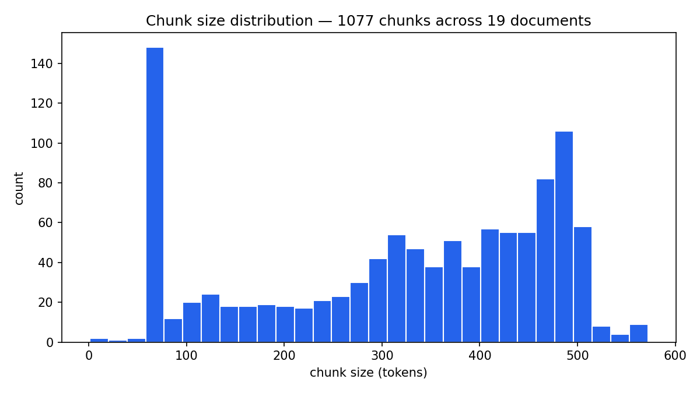

# Chunk quality report

- Documents ingested: 19
- Total chunks: 1077
- Token count — min 1, median 352, max 572
- Empty chunks: 0
- Garbage chunks (< 40 tokens or < 50% alphanumeric): 3 (0.3% of total)

## Per-document breakdown

| doc_id | chunks | median tokens | min | max |
|---|---|---|---|---|
| fsca_conduct_standard_otc_derivatives_2018 | 17 | 313 | 213 | 462 |
| fsca_press_conduct_standard_banks_2020 | 1 | 300 | 300 | 300 |
| fsca_rdr_2014 | 312 | 351 | 1 | 571 |
| fsca_rdr_intermediary_segmentation_2019 | 9 | 336 | 99 | 461 |
| fsca_tcf_2011 | 3 | 300 | 174 | 335 |
| ifrs9_project_summary_2014 | 31 | 341 | 75 | 564 |
| nca_act_34_2005 | 558 | 364 | 26 | 572 |
| nca_notebook_brochure | 18 | 361 | 276 | 449 |
| ncr_guideline_disputed_credit_complaints | 5 | 301 | 146 | 452 |
| ncr_guideline_feb_2026_clearance_certificates | 7 | 184 | 75 | 488 |
| ncr_guideline_june_2025_credit_info | 4 | 301 | 75 | 407 |
| ncr_guideline_sept_2025_debt_counsellors | 3 | 305 | 101 | 444 |
| pwc_practical_guide_ifrs9 | 51 | 275 | 75 | 561 |
| sarb_circular_19_2004_capital_hybrid_instruments | 21 | 389 | 210 | 572 |
| sarb_circular_6_2004_basel_ii_update | 3 | 106 | 102 | 474 |
| sarb_d10_2021_operational_resilience | 4 | 448 | 75 | 524 |
| sarb_d3_2023_accounting_provisions_ifrs9 | 4 | 472 | 136 | 496 |
| sarb_d8_2023_threshold_amounts | 13 | 259 | 75 | 488 |
| sarb_g3_2025_climate_disclosures | 13 | 328 | 75 | 556 |

## Garbage chunks flagged

- `nca_act_34_2005` chunk 308 (page 62): '(ii) require\xa0the\xa0debt\xa0intervention\xa0applicant\xa0to\xa0attend\xa0a\xa0financial literacy\xa0programme.'
- `fsca_rdr_2014` chunk 0 (page 3): '1'
- `fsca_rdr_2014` chunk 238 (page 66): '64 Table: Implementation of Phase 1 RDR proposals No.'
